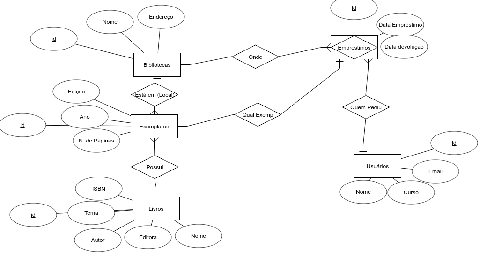
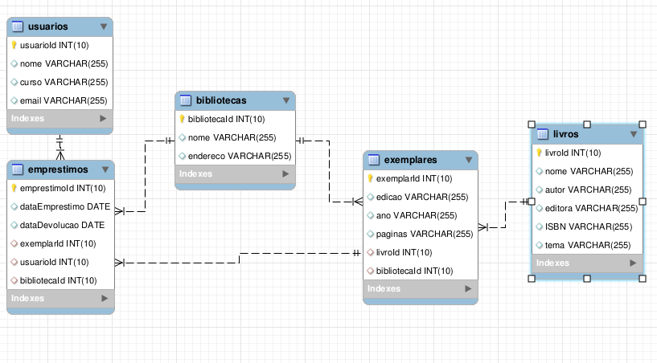

# Banco de Dados: Sistema Bibliotecário

O departamento bibliotecário (B.U.) do COLTEC requisitou ao setor de informática (S.I.) o desenvolvimento de um sistema interno para controle dos empréstimos realizados pela biblioteca.

Antes de iniciar o desenvolvimento do sistema em si, o setor de informática se reuniu com o bibliotecário responsável para entender melhor quais dados, de fato, o sistema irá gerenciar. Finalizada a reunião, o setor fez o levantamento das seguintes informações:

* O sistema deverá gerenciar os ativos da biblioteca, como os empréstimos realizados ao longo do tempo.
* Foi identificado a necessidade de armazenamento dos seguintes dados:
  * **Bibliotecas:** Dados das filiais da biblioteca existentes dentro da universidade
  * **Livros:** Dados dos livros que compõe o acervo da biblioteca
  * **Usuários:** Dados dos usuários cadastrados no B.U.
  * **Exemplares:** Dados dos exemplares dos livros que a biblioteca empresta a seus usuários
  * **Empréstimos:** Relação dos empréstimos de exemplares realizados entre os usuários e uma unidade da biblioteca

Foi levantado também quais informarções deverão ser armazenadas para os dados levantados acima:

* **Bibliotecas:** Nome e Endereço
* **Livros:** Nome, autor, editora, ISBN e tema
* **Usuários:** Nome, e-mail e curso
* **Exemplares:** Livro do qual o exemplar pertence, Biblioteca onde o exemplar foi cadastrado, edição, ano de publicação e número de páginas
* **Empréstimos:** Os exemplar que foi pedido no empréstimo, o usuário que requisitou o empréstimo, a biblioteca onde o empréstimo foi feito, a data de empréstimo e data de devolução

Ainda, foi catalogada a seguinte relação entre os dados levantados:

* Um exemplar pertence a uma biblioteca
* Uma biblioteca pode ter vários exemplares
* Um exemplar pertence somente a um livro
* Um livro pode ter vários exemplares
* Um empréstimo é feito apenas por um usuário
* Um usuário pode fazer vários empréstimos
* Um empréstimo envolve apenas um exemplar
* Um exemplar pode ser emprestado várias vezes
* Um empréstimo é feito sempre em uma biblioteca
* Uma biblioteca pode fazer vários empréstimos

## Modelo dos dados

Com base nas informações descritas acima, foi pedido que você gere os diagramas DER e DR do sistema bibliotecário. Para o DER use o software [TerraER](http://www.terraer.com.br/). Já para o diagrama DR, utilize o [MySQL Workbench](https://www.mysql.com/products/workbench/).

* DER:

* DR:


## Trabalhando com a linguagem SQL

### Criando a estrutura do banco de dados

Agora que o modelo do sistema está pronto, é hora de criar sua estrutura no SGBD!! Utilize os comandos aprendidos na aula para criar a estrutura do banco de dados. Você deverá entregar os scripts SQL utilizados para criação do banco.

```sql
create table usuarios (
    usuarioId int(10) unsigned auto_increment primary key,
    nome varchar(255),
    curso varchar(255),
    email varchar(255) unique
);

create table bibliotecas (
    bibliotecaId int(10) unsigned auto_increment primary key,
    nome varchar(255),
    endereco varchar(255)
);

create table livros (
    livroId INT(10) unsigned auto_increment primary key,
    nome varchar(255),
    autor varchar(255),
    editora varchar(255),
    ISBN varchar(255),
    tema varchar(255)
);

create table exemplares (
    exemplarId INT(10) unsigned auto_increment primary key,
    edicao varchar(255),
    ano varchar(255),
    paginas varchar(255),
    livroId int(10) unsigned,
    bibliotecaId int(10) unsigned,
   
    foreign key (livroId) references livros(livroId),
    foreign key (bibliotecaId) references bibliotecas(bibliotecaId)	
);

create table emprestimos (
    emprestimoId int(10) unsigned auto_increment primary key,
    dataEmprestimo date,
    dataDevolucao date,
    exemplarId int(10) unsigned,
    usuarioId int(10) unsigned,
    bibliotecaId int(10) unsigned,
 
    foreign key (exemplarId) references exemplares(exemplarId),
    foreign key (usuarioId) references usuarios(usuarioId),
    foreign key (bibliotecaId) references bibliotecas(bibliotecaId)  	
);
```

### Inserindo novos registros

Popule o banco de dados com **informações reais** de bibliotecas, livros, exemplares, usuários e empréstimos. Seu banco de dados deverá ter, pelo menos:

* 4 bibliotecas
```sql
insert into bibliotecas (nome, endereco) values ('Oloo', '2494 Holy Cross Avenue');
insert into bibliotecas (nome, endereco) values ('Trupe', '0617 Bayside Trail');
insert into bibliotecas (nome, endereco) values ('Skiba', '2 Hoard Circle');
insert into bibliotecas (nome, endereco) values ('Innotype', '852 Pierstorff Place');
```
* 10 usuários
```sql
insert into usuarios (nome, curso, email) values ('Catha Phare', 'Beverages (Production/Distribution)', 'cphare0@ftc.gov');
insert into usuarios (nome, curso, email) values ('Annalise Landy', 'Electrical Products', 'alandy1@com.com');
insert into usuarios (nome, curso, email) values ('Ibrahim Ledwich', 'Major Banks', 'iledwich2@flavors.me');
insert into usuarios (nome, curso, email) values ('Kinnie Aspinell', 'Real Estate Investment Trusts', 'kaspinell3@europa.eu');
insert into usuarios (nome, curso, email) values ('Berta Burrill', 'Power Generation', 'bburrill4@psu.edu');
insert into usuarios (nome, curso, email) values ('Jessey Ruprich', 'Farming/Seeds/Milling', 'jruprich5@wired.com');
insert into usuarios (nome, curso, email) values ('Yetty Connock', 'Containers/Packaging', 'yconnock6@bizjournals.com');
insert into usuarios (nome, curso, email) values ('Charles Follin', 'n/a', 'cfollin7@gravatar.com');
insert into usuarios (nome, curso, email) values ('Gwendolyn Rollitt', 'Beverages (Production/Distribution)', 'grollitt8@shinystat.com');
insert into usuarios (nome, curso, email) values ('Sydel Bigglestone', 'Restaurants', 'sbigglestone9@intel.com');
```
* 3 livros
```sql
insert into livros (nome, autor, editora, ISBN, tema) values ('Dragonfly, russian', 'Pembroke Bricket', 'Gulgowski-Carter', '467446906-6', 'Shoes');
insert into livros (nome, autor, editora, ISBN, tema) values ('Otter, brazilian', 'Pascale O''Fihillie', 'Wisozk-Kshlerin', '936384907-4', 'Books');
insert into livros (nome, autor, editora, ISBN, tema) values ('Brown antechinus', 'Augustin Evitt', 'Rosenbaum-Howe', '514953883-3', 'Computers');
```
* 10 exemplares
```sql
insert into exemplares (edicao, ano, paginas, livroId, bibliotecaId) values (50, 1919, 483, 1, 2);
insert into exemplares (edicao, ano, paginas, livroId, bibliotecaId) values (31, 1976, 439, 1, 2);
insert into exemplares (edicao, ano, paginas, livroId, bibliotecaId) values (45, 1960, 719, 1, 3);
insert into exemplares (edicao, ano, paginas, livroId, bibliotecaId) values (48, 1927, 243, 3, 1);
insert into exemplares (edicao, ano, paginas, livroId, bibliotecaId) values (31, 1986, 990, 1, 3);
insert into exemplares (edicao, ano, paginas, livroId, bibliotecaId) values (19, 1939, 166, 3, 3);
insert into exemplares (edicao, ano, paginas, livroId, bibliotecaId) values (43, 2016, 213, 3, 4);
insert into exemplares (edicao, ano, paginas, livroId, bibliotecaId) values (13, 1907, 827, 3, 3);
insert into exemplares (edicao, ano, paginas, livroId, bibliotecaId) values (34, 1991, 787, 1, 3);
insert into exemplares (edicao, ano, paginas, livroId, bibliotecaId) values (29, 1981, 918, 3, 1);
```
* 8 empréstimos
```sql
insert into emprestimos (dataEmprestimo, dataDevolucao, exemplarId, usuarioId, bibliotecaId) values ('2015-08-11', '2016-11-04', 8, 2, 1);
insert into emprestimos (dataEmprestimo, dataDevolucao, exemplarId, usuarioId, bibliotecaId) values ('2015-04-03', '2016-11-24', 3, 1, 2);
insert into emprestimos (dataEmprestimo, dataDevolucao, exemplarId, usuarioId, bibliotecaId) values ('2014-04-07', '2016-11-20', 1, 1, 3);
insert into emprestimos (dataEmprestimo, dataDevolucao, exemplarId, usuarioId, bibliotecaId) values ('2014-03-17', '2017-05-21', 6, 1, 1);
insert into emprestimos (dataEmprestimo, dataDevolucao, exemplarId, usuarioId, bibliotecaId) values ('2014-02-08', '2017-02-18', 5, 1, 3);
insert into emprestimos (dataEmprestimo, dataDevolucao, exemplarId, usuarioId, bibliotecaId) values ('2011-05-01', '2017-01-20', 6, 2, 3);
insert into emprestimos (dataEmprestimo, dataDevolucao, exemplarId, usuarioId, bibliotecaId) values ('2012-10-08', '2017-08-19', 1, 2, 3);
insert into emprestimos (dataEmprestimo, dataDevolucao, exemplarId, usuarioId, bibliotecaId) values ('2014-05-14', '2016-12-12', 4, 1, 2);
```
OBS: Quando estava fazendo o exercício, usei dados lorem-like, como não foi informado a especificação sobre o que são informações reais, usei o [https://www.mockaroo.com/](Mockaroo) para gerar os dados para a entrega, espero que não haja problemas, aliás, ótima ferramenta.

### Realizando consultas no SGBD

Com os dados cadastrados, implemente o código SQL que realize as consultas abaixo:

1. Listar o nome de todas as bibliotecas
```sql
select nome from bibliotecas;
```
2. Listar o nome de todos os usuários do curso de informática
```sql
select nome from usuarios where curso="informática";
```
3. Listar o nome e autor dos livros de computação
```sql
select nome,autor from livros where tema="computação";
```
4. Listar os exemplares que foram publicados após os anos de 2010
```sql
select * from exemplares where ano > 2010;
```
5. Listar os exemplares cadastrados na biblioteca central
```sql
select * from exemplares, bibliotecas where exemplares.bibliotecaId = bibliotecas.bibliotecaId and bibliotecas.nome like '%biblioteca central%';
```
6. Listar todos os empréstimos realizados pelo usuário 'João'
```sql
select * from emprestimos, usuarios where usuarios.usuarioId = emprestimos.usuarioId and usuarios.nome like '%João%';
```
7. Listar os empréstimos de 'João' feitos na biblioteca central
```sql
select * from emprestimos, usuarios, bibliotecas where usuarios.usuarioId = emprestimos.usuarioId and usuarios.nome like '%João%' and emprestimos.bibliotecaId = bibliotecas.bibliotecaId and bibliotecas.nome like '%biblioteca central%';
```
8. Listar o nome dos exemplares que foram emprestados pelo menos uma vez (procure saber sobre o comando DISTINCT)
```sql
select distinct exemplarId from emprestimos;
```
9. Listar as bibliotecas  que realizarem empréstimos pelo menos uma vez (procure saber sobre o comando DISTINCT)
```sql
select distinct bibliotecaId from emprestimos;
```
